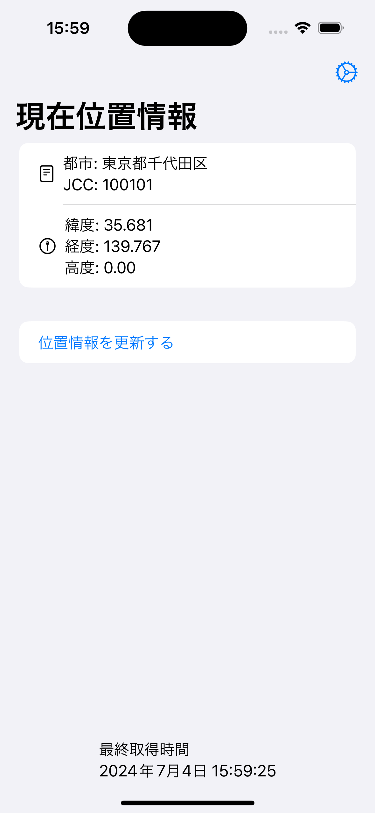
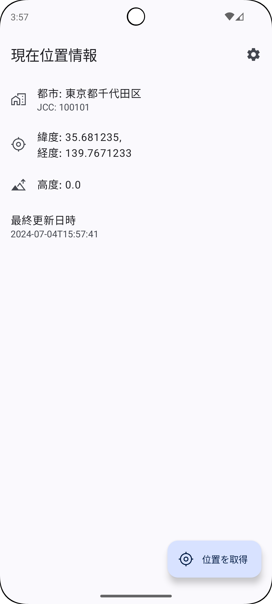

# リバースジオコーディングアプリ

|                        |                            |
|------------------------|----------------------------|
|  |  |

このオープンソースアプリケーションは、国土地理院が公開する行政区分データを用いて、高速かつ効率的なリバースジオコーディングを提供します。このアプリは、Kotlin MultiplatformとRoomを利用して、iOSとAndroidの両プラットフォームで動作します。

## 特徴

- **Kotlin MultiplatformとRoomの統合**: iOSとAndroidの両方で統一されたデータベース処理を実現。
- **最適化されたGSIデータ**: 国土地理院の行政区分データをスマートフォンで動作させるために適した形式に変換し、高速なリバースジオコーディングを実現。
- **オープンソース**: アプリケーションのソースコードはライセンスの範囲内で自由に使用可能。

## プロジェクト構成

このプロジェクトは、Gradleで管理された複数のモジュールで構成されています。各モジュールの役割は以下の通りです。

### javan_administrative_divisions
スマートフォンで実行する際、アプリに組み込むデータベースファイルのモジュールです。DBファイルは容量が多いため、AndroidではPlay Asset Deliveryを使用し、iOSではOn-Demand Resourcesを使用してアプリに提供します。

### gsi_feature_preparation
国土地理院からダウンロードした行政区分データをアプリ内で利用できる形式に変換し、DBファイルを生成するJavaプロジェクトです。

### gsi_feature_database
Android/iOSから参照するRoom DatabaseのスキーマやDAOを定義したマルチプラットフォーム向けKotlinライブラリモジュールです。

### iOS App
iOSのアプリケーションです。

### app
Androidのアプリケーションです。

## ビルド手順

### 1. 行政区分データの準備

最新の行政区分データを[国土数値情報ダウンロードサイト](https://nlftp.mlit.go.jp/ksj/gml/datalist/KsjTmplt-N03-2024.html)からダウンロードして解凍します。2024年7月時点で全国データの最新版ファイル名は`N03-20240101_GML.zip`です。

JARLによるJCC/JCGナンバー情報を7K2ABV氏の[平成の全市町村交信アワード](https://www7a.biglobe.ne.jp/~mss7k4/ZSKTS-AWD.mcsv)からダウンロードします。

ダウンロードしたファイルをPCの適当なところに配置し、`gsi_feature_preparation/src/main/resources/config.properties`ファイルを作成、編集します。

```properties
inputFilePath = /path/to/N03-20240101.geojson # ダウンロードzipに含まれるgeojsonファイルのパス
awardFilePath = /path/to/ZSKTS-AWD.mcsv.txt # ダウンロードした ZSKTS-AWS.mcsv ファイルのパス
outputDirectoryPath = /path/to/ReverseGeocoder/japan_administrative_divisions/src/main/assets # 出力先ディレクトリのパス。 japan_administrative_divisions/src/main/assets の絶対パス
```

### 2. データの変換

Android Studioでcloneしたディレクトリと同じ階層を開きます。

プロジェクトをビルドして`gsi_feature_preparation/src/main/java/com/covelline/gsi_feature_preparation/Main.kt`を実行します。自動的にデータ変換が行われてDBファイルが作成されます。

### 3. アプリの実行（Android）

appモジュールのBuild Variantsを`ossDebug`に設定してappを実行します。

### 4. アプリの実行（iOS）

Xcodeで`iosApp/iosApp.xcodeproj`を開き、Targetを`oss`に設定してビルド・実行します。

# ライセンス

このプロジェクトはMITライセンスの下で公開されています。詳細については[LICENSE](LICENSE)をご覧ください。
